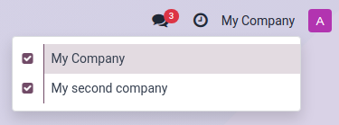
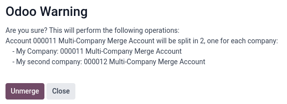

=============
Consolidation
=============

Imagine you have **several separate companies**, each with its own books. Consolidation lets you
combine their financial data into **a single unified view** giving you a "fair image" of the entire
group's financial health.

In essence, consolidation in Odoo helps you gain a clear, comprehensive view of your group's
financial performance by combining data from multiple companies.

How it Works in Odoo
====================

**Several tools** combined together will contribute to the construction of your financial
consolidation:

#. **Account Mapping:** First, you can map similar accounts from different companies together. This
   allows Odoo to combine them correctly in your consolidated reports.

#. **Multi-Ledgers:** Ledgers are fundamental to the process of consolidation. They can either be:

   - *Regular Ledgers:* Each of your companies has its own standard accounting ledger where all the
     regular day--to-day transactions are recorded.

   - *Consolidation Adjustments:* Each company also has special "MISC" journal just for
     consolidation adjustments. This is where you make any tweaks needed to get everything to line
     up correctly for the consolidation view.

   - *Multi-Ledgers for Exclusion:* For each company, you can create a special multi-ledger which
     excludes that company's consolidation adjustment journal. This gives you a clear picture of
     the company's finances before consolidation adjustments are applied.

   - *Multi-Ledger for Consolidation:* The company doing the actual consolidation also has a
     special multi-ledger. This one includes all the other companies' consolidation adjustments
     journals (the ones excluded from their own ledgers). This lets you see the total impact of all
     the adjustments.

#. **Multi-Company Selector:** To see the consolidated view, you'll use the multi-company selector.
   Select the consolidating company as your current company, and then make the other companies
   visible in the selector. This allows you to see all the journal items from the consolidating
   company's perspective.

#. **Horizontal Groups:** Odoo's reporting tools let you combine those multi-ledgers and use
   horizontal groups to see the consolidated Balance Sheet or P&L. You can eve see how much each
   company contributes to the overall consolidated figures.

   .. important::
      When you open financial reports, they usually default to a statutory view, meaning they use
      the company's regular ledger (including its consolidation adjustment). To see the full
      consolidation picture, you need to **make sure to select the multi-ledger** that includes all
      the consolidation adjustments.

#. **Group bys:** You can group by company, account, or any other dimension you want to see in your
   consolidated reports.

#. **Cumulative Translation Adjustments:** When consolidating companies with different currencies,
   Odoo handles the translation.

   - *Equity accounts:* Use the historical exchange rate.

   - *Profit & Loss (P&L) accounts:* Use the average exchange rate.

   - *Balance sheet accounts (excluding equity):* Use the closing exchange rate.

   .. important::
      The rates used are the ones from the running company.

#. **Multi-Company Selector:** To see the consolidated view, you'll use the multi-company selector.
   Select the consolidating company as your current company, and then make the other companies
   visible in the selector. This allows you to see all the journal items from the consolidating
   company's perspective.

Consolidating Companies vs. Branch Management
=============================================

Consolidating companies involves legally separate entities whereas branches are subdivisions of a
single legal entity which often share the head office's resources (journals, taxes, accounts,
fiscal positions) and are not consolidated in the same way.

.. _merge_tool:

Account Merging
===============

You can merge accounts to reduce the number of accounts and standardize them across companies. This
is optional; consolidation works without it.

Steps
-----

To use the merge tool, select all the companies with an account that needs to be merged in the
company selector in the top right corner of the screen.

Then, go to :menuselection:`Accounting --> Configuration --> Chart of Accounts` and select the
accounts to merge. Click the :icon:`fa-cog` :guilabel:`Actions` menu and select :guilabel:`Merge
accounts`.

In the :guilabel:`Merge accounts` window, enable the :guilabel:`Group by name?` option if needed and
click :guilabel:`Merge`.

The selected accounts are then merged into a single shared account, accessible by all the chosen
companies, just as if the account had been directly created to be shared.

.. _unmerge_tool:

Account Unmerging
=================

You can also unmerge accounts if ever needed.

.. warning::

   Note that unmerging accounts **does not unmerge the chatters** of the accounts. Once merged, the
   chatters are permanently merged.

Steps
-----

To unmerge accounts, select a company with a shared account in the top right corner of the screen.
Then, go to :menuselection:`Accounting --> Configuration --> Chart of Accounts` and select the
account to unmerge. Click the :icon:`fa-cog` :guilabel:`Actions` menu and select
:guilabel:`Unmerge accounts`.

An :guilabel:`Odoo Warning` confirmation pop-up window will appear, listing how the accounts will
be split.

A new account linked to each company will be created for the previously shared account.

Possibility to Import the Mapping
=================================

You can also import the accounts mapping.
