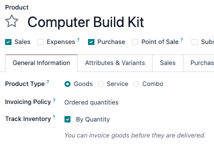
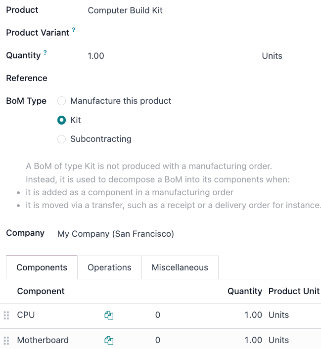
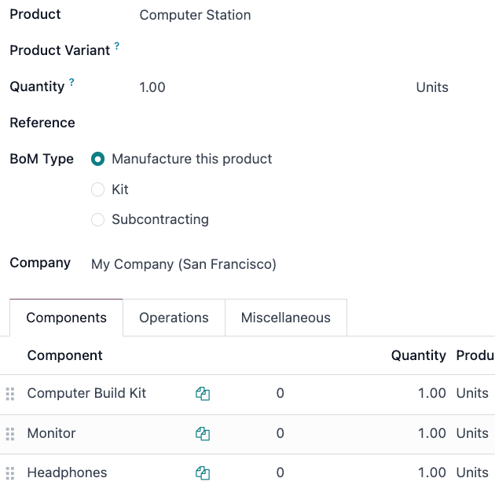
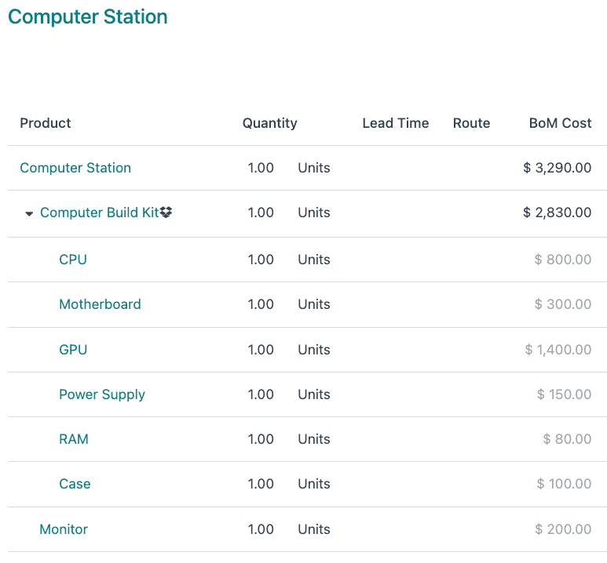

========
Use kits
========

In Odoo, a *kit* is a type of bill of materials (BoM) that can be manufactured and sold. Kits are
sets of unassembled components sold to customers. They may be sold as standalone products, but are
also useful tools for managing more complex bills of materials (BoMs).

.. note::
   To use, manufacture, and sell kits, both the :guilabel:`Manufacturing` and :guilabel:`Inventory`
   apps need to be installed.

Create the kit as a product
===========================

To use a kit as a sellable product, or as a component organization tool, the kit should first
be created as a product.

To create a kit product, go to :menuselection:`Inventory app --> Products --> Products`, then select
:guilabel:`New`.

Enter a name to the new kit product. Next, under the :guilabel:`General Information` tab, set
the :guilabel:`Product Type` to :guilabel:`Goods`. Then, select the checkbox next to :guilabel:`Track Inventory`. From the drop-down menu, select :guilabel:`By Quantity`.

The kit's components must also be configured as products via :menuselection:`Inventory app -->
Products --> Products`. These components require no specific configuration.

Set up the kit BoM
==================

After fully configuring the kit product and its components, a new :abbr:`BoM (bill of materials)`
can be created for the kit product.

To do so, go to :menuselection:`Manufacturing app --> Products --> Bills of Materials`, then select
:guilabel:`New`. Next to the :guilabel:`Product` field, select the drop-down menu to reveal a list
of products, then select the previously configured kit product.

Then, for the :guilabel:`BoM Type` field, select the :guilabel:`Kit` option. Finally, under the
:guilabel:`Components` tab, select :guilabel:`Add a line`, then add each desired component and
specify their quantities under the :guilabel:`Quantity` column.

Once ready, select :guilabel:`Save` to save the newly-created :abbr:`BoM (bill of materials)`.

If the kit is solely being used as a sellable product, then only components need to be added under
the :guilabel:`Components` tab, and configuring manufacturing operations is not necessary. Kits can be added as components to other kits, which is described in the next section.

.. note::
   When a kit is sold as a product, it appears as a single line item on the quotation and sales
   order. However, on delivery orders, each component of the kit is listed.

Use kits to manage complex BoMs
===============================

Kits are also used to manage multi-level :abbr:`BoMs (bills of materials)`. These are products that
contain **other** :abbr:`BoM (bill of materials)` products as components, and therefore require
*nested* :abbr:`BoMs (bills of materials)`. Incorporating preconfigured kits into multi-level
:abbr:`BoMs (bills of materials)` allows for cleaner organization of bundled products.

To configure this type of :abbr:`BoM (bill of materials)` with a kit as a component, go to
:menuselection:`Manufacturing app --> Products --> Bills of Materials`, then select
:guilabel:`New`.

Next to the :guilabel:`Product` field, select the drop-down menu to reveal a list of products, and
select the desired :abbr:`BoM (bill of materials)` product. Then, for the :guilabel:`BoM Type`
field, select the :guilabel:`Manufacture this product` option.

Under the :guilabel:`Components` tab, select :guilabel:`Add a line`, then select a kit as the
component. Adding the kit as a component eliminates the need to add the kit's components
individually. Any :guilabel:`BoM Type` can be used for the higher-level product's :abbr:`BoM (bill
of materials)`.

Once ready, select :guilabel:`Save` to save changes.

Preview multi-level BoMs
------------------------

To access a comprehensive overview of the multi-level :abbr:`BoM's (bill of material's)` components,
select on the :guilabel:`BoM Overview` smart button. Sublevel :abbr:`BoMs (bills of materials)`
can be expanded and viewed from this report.

When creating a manufacturing order for a product with a multi-level :abbr:`BoM (bill of
materials)`, the kit product automatically expands to show all components. Any operations in the
kit's :abbr:`BoM (bill of materials)` are also added to the list of work orders on the
manufacturing order.

.. tip::
   Kits are primarily used to bundle components together for organization or sale. However, you can use :doc:`sub-assemblies<sub_assemblies>` to manage
   multi-level products that require manufactured sub-components.
